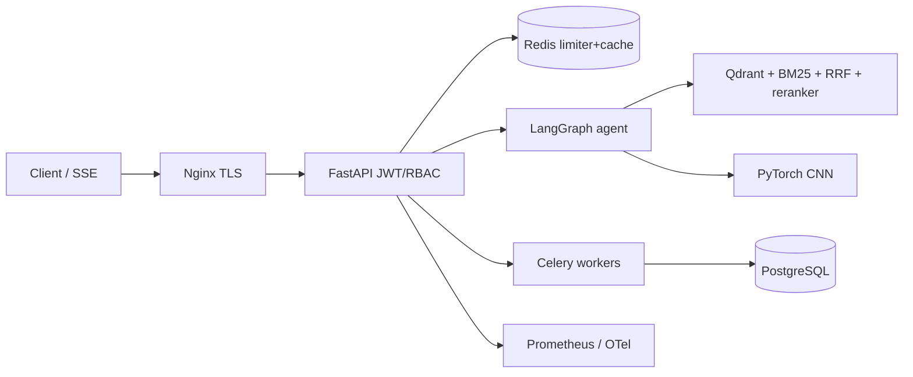

# EAVIE architecture

```mermaid
flowchart LR
  C[Client / SSE] --> N[Nginx TLS] --> A[FastAPI JWT/RBAC]
  A --> R[(Redis limiter+cache)]
  A --> G[LangGraph agent]
  G --> Q[Qdrant + BM25 + RRF + reranker]
  G --> V[PyTorch CNN]
  A --> W[Celery workers] --> P[(PostgreSQL)]
  A --> M[Prometheus / OTel]
```
Agent graph: guardrail -> (rag | vision) -> evaluator -> (retry rag | synthesizer).
